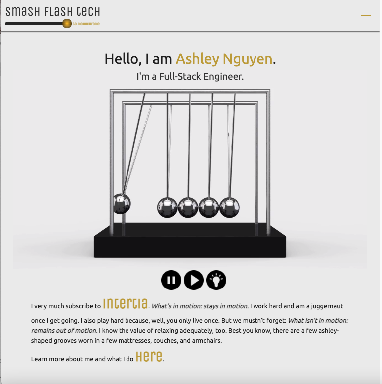
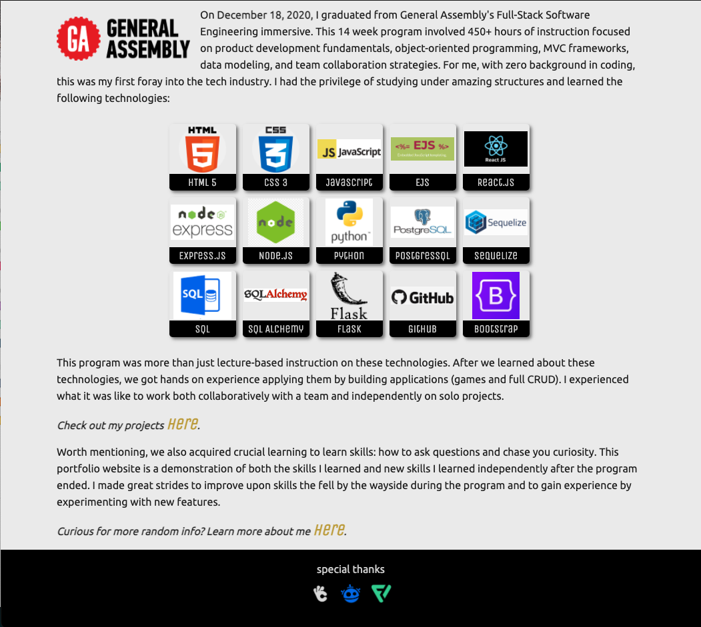
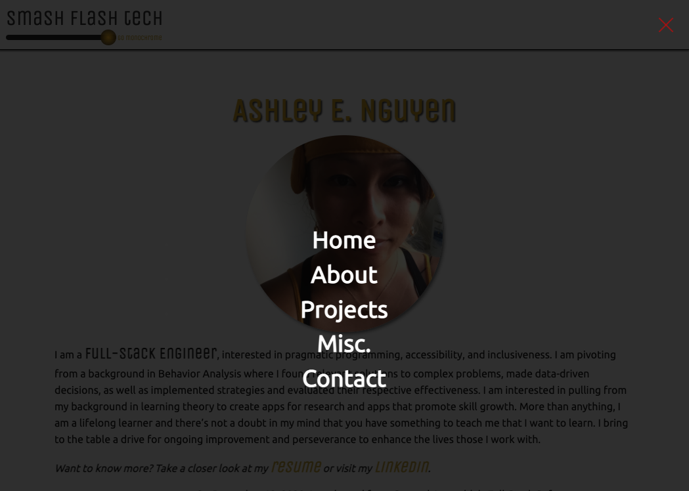
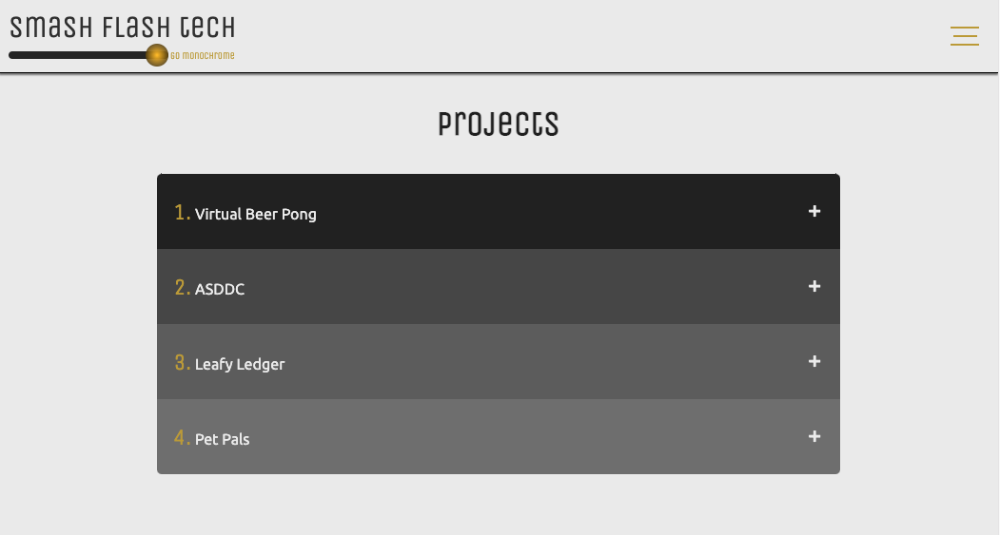
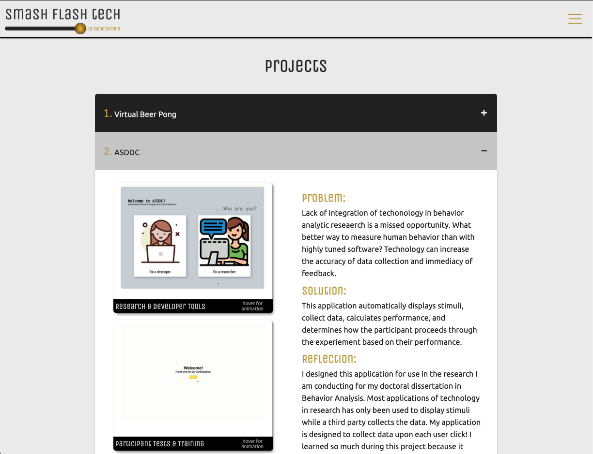
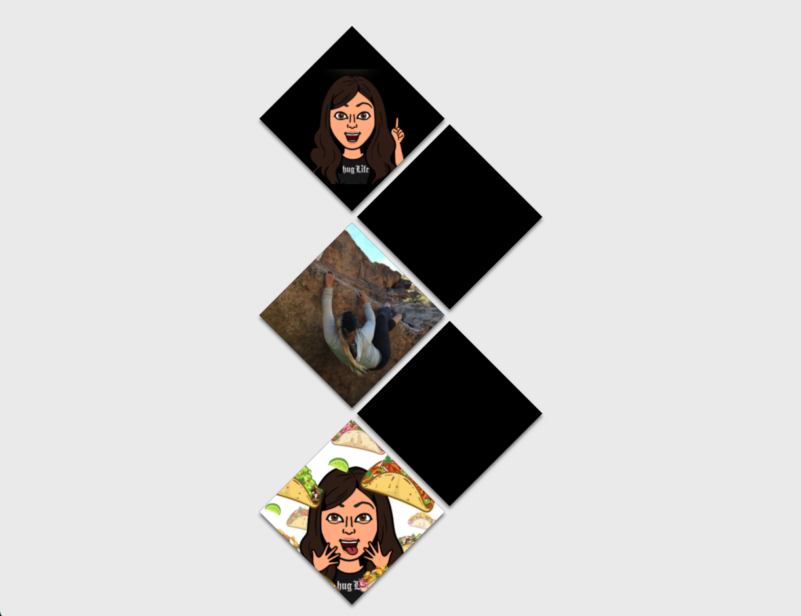
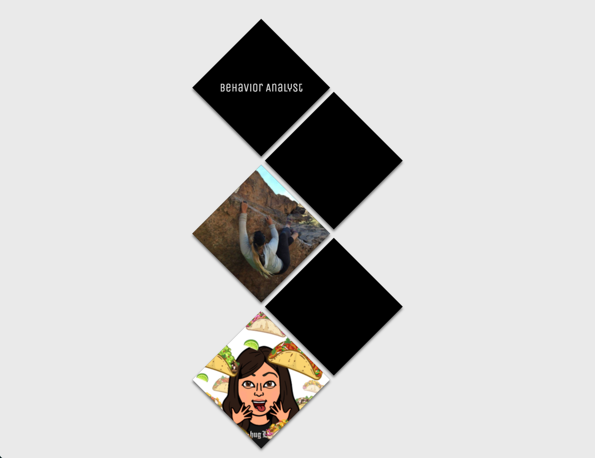
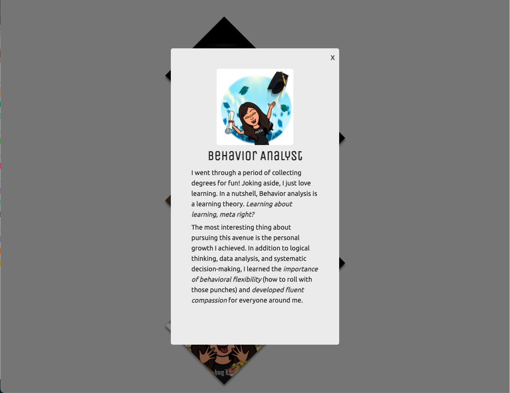
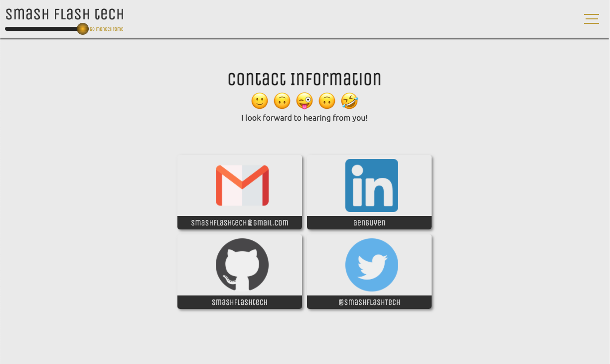

# SmashFlashTech - A Portfolio

This is my first ever portfolio website. Here you can get to know me a little better, see my work, and find ways to get in touch. 

### Motivation
First and foremost, I would love a job. Hire me! I recently completed General Assembly's Software Engineering Immersive in December 2020. As rigorous as any bootcamp always is, there always is still more to learn and more to be done. I wanted to create a website to establish my digital presence, showcase my projects, continue to practice and learn new skills that I may not have gotten to try up to this day. I treated this website like a playground and took the opportunity to continue developing a thorough understanding and to acquire new skills. 

### Preview

### User Stories & Wireframes
As a user, I want to read information about the website owner, view their work, and find their contact information. The user will be able to view this portfolio across multiple devices of varying screen sizes.

### Technologies
* HTML
* CSS
* Javascript

### Future development
Future iterations may include adding a blog and building out a back-end.